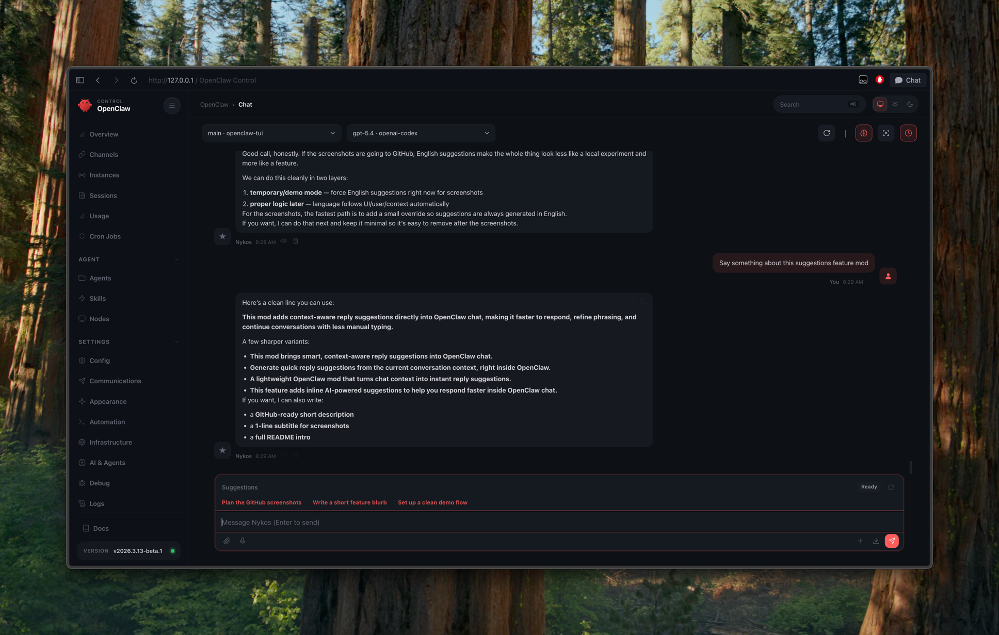
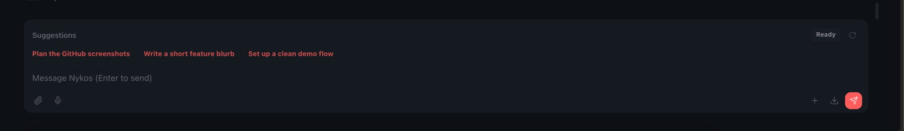
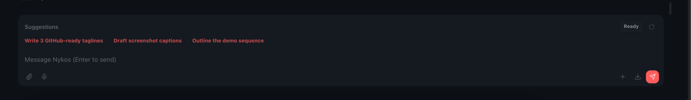

# OpenClaw Chat Suggestions Patch

Patch version: `0.1.0`  
Target OpenClaw version: `v2026.3.13-beta.1`

This patch adds context-aware reply suggestions directly into OpenClaw chat, making it faster to respond, refine phrasing, and continue conversations with less manual typing.

## Screenshots

### Full chat view with suggestions composer


### Suggestions bar above the composer


### Alternate suggestion set from the same flow


### Suggestion transformed into an editable prompt


## Install from archive
```bash
tar -xzf openclaw-patch-chat-suggestions-v2026.3.13-beta.1.tar.gz
cd openclaw-patch-chat-suggestions
./patch-chat-suggestions.sh
```

## Install via downloader
```bash
curl -fsSL -o patch-chat-suggestions-downloader.sh https://raw.githubusercontent.com/nykadamec/openclaw_chat-suggestions/v2026.3.13-beta.1/patch-chat-suggestions-downloader.sh
bash patch-chat-suggestions-downloader.sh
```

## Revert
```bash
./patch-chat-suggestions.sh --revert
```
